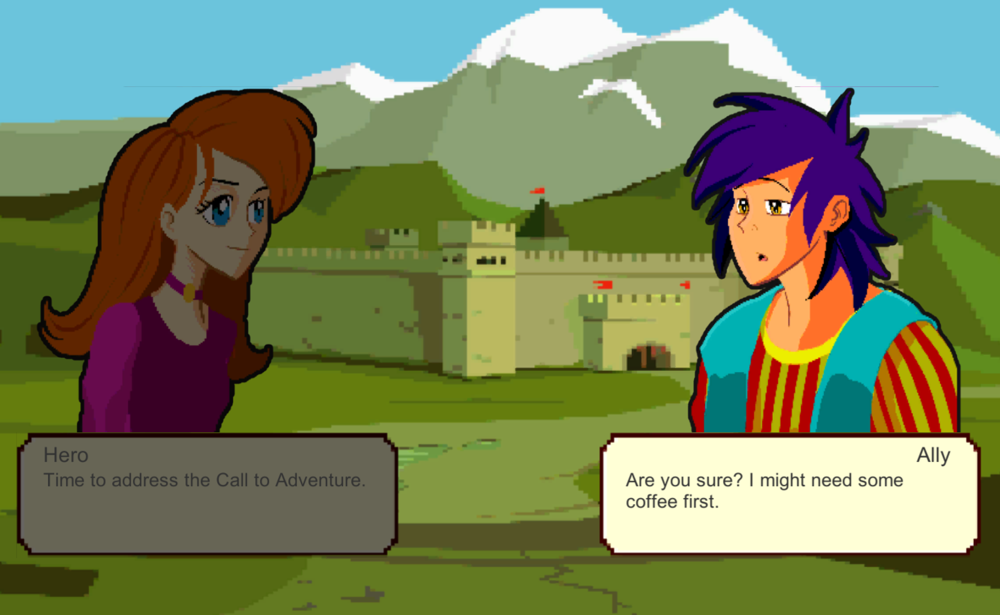

# A Character Dialogue System in Unity with JSON



## Summary

Game programmers and designers are often left to fend for themselves when learning how to write, structure, and manage efficient event systems of their own making.
This project display the building blocks of an interactive system, abstracting building blocks into a scalable management class.

In this project we have two goals:

1. to convey how fundamental programming patterns and industry standards apply to game development.
2. to equip developers with the theoretical tools needed to inject their projects with engaging narratives, resulting in emotional player investment that comes with story-driven gameplay.

See my [Course Notes](BuildACharacterDialogueSystem.md) to more in-depth information.

## Tools

* [litJSON.net](https://litjson.net/) - an open-source JSON library
* [TexturePacker](https://www.codeandweb.com/texturepacker) - free and pro versions to create Texture Atlas
* [Unity 2019.3.13f1](https://unity3d.com/)

## Credits

Based on [this course](https://www.linkedin.com/learning/unity-5-build-a-character-dialogue-system/) from Harrison Ferrone.

## A Dialogue in JSON

```JSON
{
  "dialogues":
  [
        {
          "characterType": 0,
          "name": "Hero",
          "atlasImageName": "Hero_Default",
          "dialogueText": "Time to address the Call to Adventure."
        },
        {
          "characterType": 1,
          "name": "Ally",
          "atlasImageName": "Heroine_Surprised",
          "dialogueText": "Are you sure? I might need some coffee first."
        }
  ]
}

```
